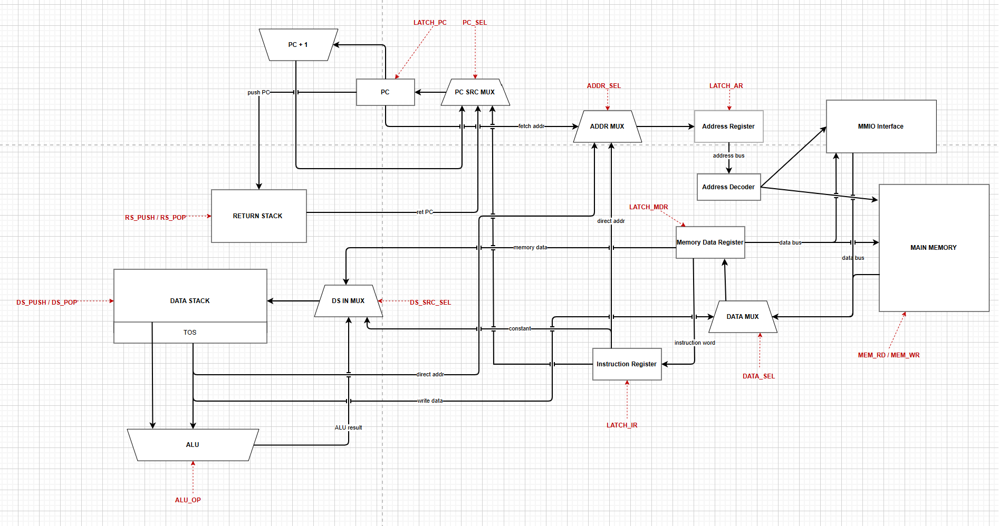
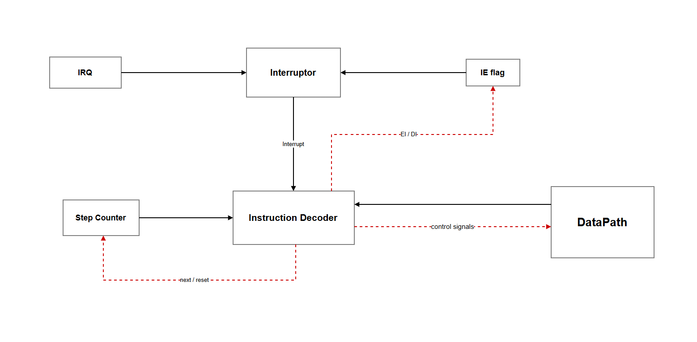

# Лабораторная работа №4

**ФИО:** Изаак Герман Константинович  
**Группа:** P3217  
**Вариант:** `lisp | stack | neum | hw | tick | binary | trap | mem | cstr | prob2`

---

## Язык программирования

Реализован упрощённый диалект Lisp. Синтаксис построен на S-выражениях. Семантика аппликативная (аргументы вычисляются до вызова). Центральный принцип: каждая форма является выражением и оставляет ровно одно значение на стеке данных.

### Синтаксис (БНФ)

```bnf
program         ::= top-form*

top-form        ::= defisr-form
                  | expr

defisr-form     ::= "(" "defisr" expr+ ")"

; Выражения
expr            ::= literal
                  | variable
                  | setq-form
                  | if-form
                  | progn-form
                  | loop-form
                  | defun-form
                  | arith-form
                  | cmp-form
                  | not-form
                  | load-form
                  | store-form
                  | read-form
                  | print-form
                  | halt-form
                  | int64-form
                  | call-form

; Управление выполнением
setq-form       ::= "(" "setq"  identifier expr ")"
if-form         ::= "(" "if"    expr expr expr? ")"
progn-form      ::= "(" "progn" expr* ")"
loop-form       ::= "(" "loop"  expr expr ")"
defun-form      ::= "(" "defun" identifier "(" identifier* ")" expr+ ")"

; Арифметика
arith-form      ::= "(" arith-op expr expr ")"
arith-op        ::= "+" | "-" | "*" | "/" | "mod"

; Сравнение
cmp-form        ::= "(" cmp-op expr expr ")"
cmp-op          ::= "=" | "!=" | "<" | ">" | "<=" | ">="

not-form        ::= "(" "not" expr ")"

; Работа с памятью
load-form       ::= "(" "load" expr ")"
store-form      ::= "(" "store-at" expr expr ")"

; Ввод-вывод 
read-form       ::= "(" "read" ")"
print-form      ::= "(" "print-char" expr ")"
                  | "(" "print-int" expr ")"
                  | "(" "print-int64" expr expr ")"
halt-form       ::= "(" "halt" ")"

; 64-битная арифметика 
int64-form      ::= "(" "adc" expr expr ")"
                  | "(" "sbb" expr expr ")"
                  | "(" "mul64" expr expr identifier identifier ")"
                  | "(" "push-carry" ")"
                  | "(" "push-overflow" ")"

; Вызов функции 
call-form       ::= "(" identifier expr* ")"

; Атомарные значения
literal         ::= number | string
variable        ::= identifier

number          ::= "-"? [0-9]+
string          ::= '"' [^"]* '"'
identifier      ::= [a-zA-Z_] [a-zA-Z0-9_\-+*/=<>!?]*
```

### Семантика

| Аспект | Описание                                                                                                                                                                                        |
|--------|-------------------------------------------------------------------------------------------------------------------------------------------------------------------------------------------------|
| Стратегия | Аппликативный порядок: аргументы вычисляются слева направо до применения функции                                                                                                                |
| Область видимости | Переменные являются глобальными (`setq`). <br/>Аргументы функций – локальные                                                                                                                    |
| Типы | Единственный числовой тип: знаковое 32-битное целое число `[−2³¹, 2³¹−1]`.<br/> Строки хранятся как C-строки. <br/>64-битные числа представляются парой `(hi, lo)`, два соседних машинных слова |
| Возврат | Каждая форма оставляет ровно одно значение на стеке данных                                                                                                       |

### Встроенные формы

**Управление вычислением:**

```lisp
(setq name expr)             ; Присвоить переменной значение. Возвращает присвоенное значение.
(if cond then [else])        ; Ветвление. Если else опущен, то возвращает 0 для ложной ветки.
(progn e1 e2 ... eN)         ; Последовательность. Возвращает значение последнего выражения.
(loop cond body)             ; Цикл while. Возвращает последний результат body (или 0).
(defun name (args) body...)  ; Объявление функции. Тело – неявный progn.
```

**Работа с памятью:**

```lisp
(load addr)               ; Косвенное чтение: *(addr).
(store-at addr val)       ; Косвенная запись: *(addr) = val. Возвращает 0.
```

**Ввод-вывод:**

```lisp
(read)                    ; Прочитать один байт из порта ввода (PORT_IN, 0x0FF1).
(print-char val)          ; Вывести байт как ASCII-символ (PORT_OUT_CHAR, 0x0FF0).
(print-int val)           ; Вывести 32-битное число десятично (PORT_OUT_INT, 0x0FF2).
(print-int64 hi lo)       ; Вывести 64-битное число (пара hi:lo) десятично.
(halt)                    ; Остановить машину.
```

**Арифметика двойной точности:**

```lisp
(adc a b)                 ; a + b + C -> стек; обновляет флаг C (carry).
(sbb a b)                 ; a − b − C -> стек; обновляет флаг C (borrow).
(mul64 a b lo-var hi-var) ; 32x32 -> 64: lo 32 бита -> lo-var, hi -> hi-var. Возвращает 0.
(push-carry)              ; Положить текущее значение флага C на стек.
(push-overflow)           ; Положить текущее значение флага V на стек.
```

**Обработчик прерываний:**

```lisp
(defisr expr1 ... exprN)  ; Объявить ISR (Interrupt Service Routine).
                          ; Размещается в конце бинарника; адрес 0 содержит JMP на него.
```

### Примеры программ

<details>
<summary>hello.lisp – вывод строки</summary>

```lisp
(defun print-string (ptr)
  (setq ch (load ptr))
  (loop (!= ch 0)
    (progn
      (print-char ch)
      (setq ptr (+ ptr 1))
      (setq ch (load ptr)))))

(print-string "Hello, World!")
(print-char 10)
```

</details>

<details>
<summary>cat.lisp – trap I/O, посимвольный вывод</summary>

```lisp
(defisr
  (setq c (read))
  (if (!= c 0)
    (print-char c)
    (halt)))

(loop 1 0)
```

</details>

<details>
<summary>prob2.lisp – Задача Эйлера №6</summary>

```lisp
; Разность квадрата суммы и суммы квадратов первых 100 чисел
(setq n 100)

(setq sum-sq 0)
(setq i 1)
(loop (<= i n)
  (progn (setq sum-sq (+ sum-sq (* i i))) (setq i (+ i 1))))

(setq s 0)
(setq i 1)
(loop (<= i n)
  (progn (setq s (+ s i)) (setq i (+ i 1))))

(print-int (- (* s s) sum-sq))
(print-char 10)
```

</details>

---

## Организация памяти

Архитектура фон Неймана: код и данные хранятся в одной адресуемой памяти объёмом 4096 слов. Машинное слово – 32 бита.

### Карта памяти

```
Адрес     Назначение
──────────────────────────────────────────────────────
0x0000    Вектор прерываний: JMP <ISR-адрес>
0x0001 …  Код программы
   …      Статические данные
0x0400 …  Переменные (MEM_DATA_START = 1024)
   …
0x0FEF    последняя ячейка данных
──────────────────────────────────────────────────────
0x0FF0    PORT_OUT_CHAR     – вывод ASCII-символа
0x0FF1    PORT_IN           – ввод (чтение символа)
0x0FF2    PORT_OUT_INT      – вывод 32-битного числа
0x0FF3    PORT_OUT_INT64_HI – буфер hi-части 64-бит числа
0x0FF4    PORT_OUT_INT64_LO – вывод 64-бит числа (hi<<32|lo)
──────────────────────────────────────────────────────
```

### Аппаратные стеки

Стеки физически вынесены за пределы основной памяти:

- **Data Stack** – стек операндов. TOS напрямую подаётся на входы АЛУ.
- **Return Stack** – адреса возврата для `CALL`/`RET` и сохранённые `PC` при прерываниях.

### Прерывания

При появлении символа в аппаратном регистре ввода выставляется сигнал IRQ. Если разрешение прерываний включено (`IE = 1`), прерывание обрабатывается на любом такте, включая такты внутри цикла исполнения:

1. Сохраняет `instr_pc` (адрес начала прерванной инструкции) на Return Stack.
2. Устанавливает `PC = 0` (вектор прерываний) и сбрасывает `IE = 0`.
3. Выполняет `JMP <ISR>`.
4. ISR завершается инструкцией `IRET`, которая восстанавливает `PC` и устанавливает `IE = 1`.

Прерванная инструкция перезапускается после `IRET`: операция над стеком/памятью происходит только на последнем такте EXEC, поэтому в момент прерывания стек гарантированно консистентен.

**Инициализация IE:** машина стартует с `IE = 0`. Транслятор автоматически вставляет инструкцию `STI` после блока инициализации переменных (`setq`/`defun`), гарантируя, что ISR не прервёт незавершённую инициализацию.

---

## Система команд

### Формат машинного слова

Каждая инструкция упакована в 32 бита:

```
 31      24 23                     0
┌──────────┬────────────────────────┐
│  Opcode  │       Operand          │
│  8 бит   │       24 бита          │
└──────────┴────────────────────────┘
```

Инструкции без операнда хранят `0` в младших 24 битах. Операнды знаково расширяются до 32 бит при декодировании.

### Флаги АЛУ

| Флаг | Назначение                                                                                                                        |
|------|-----------------------------------------------------------------------------------------------------------------------------------|
| **C** (Carry/Borrow) | Устанавливается в `ADD`/`ADC` при беззнаковом переполнении. В `SUB`/`SBB` при заёме. Используется для цепочки 64-битных операций. |
| **V** (Overflow) | Устанавливается при знаковом переполнении в `ADD`/`ADC`/`SUB`/`SBB`.                                                              |

### Таблица инструкций

Количество тактов каждой инструкции складывается из цикла выборки (2 такта) и цикла исполнения (1–3 такта).

| Опкод | Мнемоника      | Операнд | Тактов | Действие | Описание                             |
|:-----:|:---------------|:-------:|:------:|:---------|:-------------------------------------|
| 0x01  | `PUSH`         |  `imm`  | **3**  | `DS.push(imm)` | Положить 24-битную константу на стек |
| 0x02  | `POP`          |    –    | **3**  | `DS.pop()` | Удалить TOS                          |
| 0x03  | `LOAD`         |    –    | **5**  | `addr=pop(); push(MEM[addr])` | Косвенное чтение из памяти           |
| 0x04  | `STORE`        |    –    | **5**  | `v=pop(); a=pop(); MEM[a]=v` | Косвенная запись в память            |
| 0x05  | `ADD`          |    –    | **3**  | `b=pop(); a=pop(); push(a+b); C,V` | Сложение; обновляет C и V            |
| 0x06  | `SUB`          |    –    | **3**  | `b=pop(); a=pop(); push(a-b); C,V` | Вычитание; обновляет C и V           |
| 0x07  | `MUL`          |    –    | **3**  | `b=pop(); a=pop(); push((a*b) & M)` | Умножение, нижние 32 бита            |
| 0x08  | `DIV`          |    –    | **3**  | `b=pop(); a=pop(); push(trunc(a/b))` | Деление к нулю                       |
| 0x09  | `MOD`          |    –    | **3**  | `b=pop(); a=pop(); push(a % b)` | Остаток от деления                   |
| 0x0A  | `CMP`          |    –    | **3**  | `b=pop(); a=pop(); push(1 if a==b else 0)` | Равенство                            |
| 0x0B  | `GT`           |    –    | **3**  | `b=pop(); a=pop(); push(1 if a>b else 0)` | Больше (знаковое)                    |
| 0x0C  | `LT`           |    –    | **3**  | `b=pop(); a=pop(); push(1 if a<b else 0)` | Меньше (знаковое)                    |
| 0x0D  | `JMP`          | `addr`  | **3**  | `PC = addr` | Безусловный переход                  |
| 0x0E  | `JZ`           | `addr`  | **3**  | `if pop()==0: PC=addr` | Переход если TOS == 0                |
| 0x0F  | `CALL`         | `addr`  | **3**  | `RS.push(PC); PC=addr` | Вызов функции                        |
| 0x10  | `RET`          |    –    | **3**  | `PC = RS.pop()` | Возврат из функции                   |
| 0x11  | `IRET`         |    –    | **3**  | `PC=RS.pop(); IE=1` | Возврат из прерывания                |
| 0x12  | `HALT`         |    –    | **3**  | останов | Остановить тактовый генератор        |
| 0x13  | `PUSH_M`       | `addr`  | **5**  | `DS.push(MEM[addr])` | Прямое чтение из памяти на стек      |
| 0x14  | `POP_M`        | `addr`  | **4**  | `MEM[addr] = DS.pop()` | Запись TOS в память напрямую         |
| 0x15  | `ADC`          |    –    | **3**  | `b=pop(); a=pop(); push(a+b+C); C,V` | Сложение с переносом                 |
| 0x16  | `SBB`          |    –    | **3**  | `b=pop(); a=pop(); push(a-b-C); C,V` | Вычитание с заёмом                   |
| 0x17  | `MUL64`        |    –    | **4**  | `b=pop(); a=pop(); push(lo); push(hi)` | Умножение 32×32 → 64                 |
| 0x18  | `PUSH_CARRY`   |    –    | **3**  | `DS.push(C)` | Флаг C на стек                       |
| 0x19  | `PUSH_OVERFLOW`|    –    | **3**  | `DS.push(V)` | Флаг V на стек                       |
| 0x1A  | `STI`          |    –    | **3**  | `IE = 1` | Разрешить прерывания                 |

*`M = 0xFFFFFFFF`. DS – Data Stack, RS – Return Stack.*

---

## Транслятор

**Файл:** `src/translator.py`

Транслятор работает в три фазы: **лексический анализ -> синтаксический анализ -> генерация кода**.

```
.lisp  ->  tokenize()  ->  parse()  ->  Compiler.compile_expr()  ->  write_code()  ->  .bin
                                                                                   ->  .bin.log
```

### Лексический анализ

Функция `tokenize()` удаляет Lisp-комментарии (`;` до конца строки), затем с помощью регулярного выражения разбивает код на токены: скобки `(` `)`, строковые литералы в `"..."` и атомы.

### Синтаксический анализ

Функция `parse()` строит AST рекурсивным спуском: `(` открывает список, `)` закрывает, токены вне скобок становятся атомами.

### Генерация кода

Класс `Compiler` обходит AST в `compile_expr()`. Ключевые свойства:

**Инвариант стека:** каждая форма оставляет ровно одно значение на Data Stack. Это позволяет произвольно вкладывать выражения и прозрачно реализовать `progn`, `setq`, `loop`, `if` как выражения.

```lisp
(setq x (loop (<= i 10) (setq i (+ i 1))))   ; работает
(print-int (if (= x 0) 42 -1))               ; работает
```

**Компиляция `loop`:**
```
PUSH 0             ; значение по умолчанию (если тело не выполнялось)
loop_start:
  <cond>           
  JZ loop_end
  POP              ; убрать предыдущий результат тела
  <body>           ; новый результат тела
  JMP loop_start
loop_end:          ; на TOS последний результат body (или 0)
```

**Компиляция `if` (без else):**
```
<cond>
JZ false_label
<then>
JMP end_label
false_label:
PUSH 0             ; else отсутствует -> 0
end_label:
```

**Компиляция `defun`:** транслятор сохраняет старые значения аргументов на Data Stack, записывает новые значения, выполняет тело, восстанавливает аргументы из стека.

**Разделение ISR и основного кода:**

При наличии `(defisr ...)` транслятор:
1. Помещает на адрес 0 инструкцию `JMP <ISR>`.
2. Делит `main_exprs` на фазу инициализации (ведущие `setq`/`defun`) и фазу логики.
3. Компилирует инициализацию -> `STI` -> логику.
4. После `HALT` компилирует тело ISR, завершая его `IRET`.


---

## Модель процессора

**Файл:** `src/machine.py`

### DataPath




### ControlUnit




**Один такт симуляции (`single_tick`):**

```
tick_counter++
доставить символ из расписания (если его такт наступил)
irq <- (input_reg ≠ None)

1) Фаза FETCH1 (такт 1 цикла выборки):
instr_pc <- PC                    # запомнить адрес текущей инструкции
если IE=1 и irq=1: -> ПРЕРЫВАНИЕ
AR <- PC;  phase <- FETCH2

2) Фаза FETCH2 (такт 2 цикла выборки)
если IE=1 и irq=1: -> ПРЕРЫВАНИЕ
IR <- MEM[AR];  PC++;  phase <- EXEC

3) Фаза EXEC (повторяется N раз) 
если IE=1 и irq=1: -> ПРЕРЫВАНИЕ
exec_ticks_left--
если exec_ticks_left == 0:
    выполнить IR                 # операция над стеком/памятью
    phase <- FETCH1

ПРЕРЫВАНИЕ (из любой фазы)
RS.push(instr_pc);  PC <- 0;  IE <- 0;  phase <- FETCH1
```

**Аппаратный регистр ввода (`input_reg`):** входной порт реализован как единственный регистр. Символ принимается только когда регистр свободен. Символ, пришедший пока регистр занят, безвозвратно теряется.

**Обработка прерывания** возможна на **любом** такте: FETCH1, FETCH2 или любом из N тактов EXEC. Поскольку операция над стеком/памятью выполняется только на последнем такте EXEC, прерывание всегда застаёт стек в консистентном состоянии, а прерванная инструкция безопасно перезапускается после `IRET`. Флаг `IE` сбрасывается при входе в ISR и восстанавливается `IRET`, предотвращая вложенные прерывания.


---

## Тестирование

### Тестовые программы

| # | Программа | Вход                        | Ожидаемый вывод                                                |  Что демонстрирует |
|:-:|:----------|:----------------------------|:---------------------------------------------------------------|:------------------|
| 1 | `hello.lisp` | –                           | `Hello, World!\n`                                              | вывод строки, `defun`, `loop`, C-строка |
| 2 | `prob2.lisp` | –                           | `25164150\n`                                                   | вычисления, алгоритм по варианту |
| 3 | `cat.lisp` | `input/cat.txt`             | `hello\n`                                                      | trap-I/O, прерывания, ISR |
| 4 | `hello_user_name.lisp` | `input/hello_user_name.txt` | `What is your name?\nHello, Alice!\n`                          | trap-I/O, строки в динамической памяти |
| 5 | `sort.lisp` | `input/sort.txt`            | `1 3 4 5 7 \n`                                                 | trap-I/O + пузырьковая сортировка |
| 6 | `double_precision.lisp` | –                           | `6000000000\n3000000000\n10000000000\n-5\n-10000000000\n`      | 64-битная арифметика: ADC, SBB, MUL64 |
| 7 | `loop_demo.lisp` | –                           | `55\n56\n1 2 3 … 9\n6\n`                                       | loop как выражение, вложенные циклы, log₂ |
| 8 | `expr_values.lisp` | –                           | `42 0\n25\n8\n10 10 7\n`                                       | каждая форма (`if`, `progn`, `loop`, `setq`) является выражением |
| 9 | `cat.lisp` | `input/input_overflow.txt`  | `h`                                                            | потеря символов при переполнении регистра ввода |


### Формат файла расписания

Файлы `input/*.txt` задают расписание событий ввода:

```
# такт  символ
10  h         # ASCII-символ
60  \n        # escape-последовательности: \n \0 \t \r
5   \x05      # произвольный байт в hex
```

Символ поступает в аппаратный регистр ввода (`input_reg`) не раньше указанного такта. Если регистр в этот момент занят – символ теряется.

### Структура golden-тестов

Каждому тесту соответствует файл `golden/<name>.yaml`. Файл самодостаточен для ревью: в нём встроены и исходный код, и входные данные, и все результаты.

| Поле | Описание                                                      |
|:-----|:--------------------------------------------------------------|
| `source_file` | Путь к исходному `.lisp`-файлу                                |
| `in_source` | Полное содержимое этого файла                                 |
| `input_file` | Путь к расписанию ввода. `null` если программа не читает ввод |
| `in_stdin` | Полное содержимое файла расписания. `null` если ввода нет     |
| `out_stdout` | Эталонный вывод программы                                     |
| `out_code_hex` | Дамп машинного кода, сгенерированный транслятором             |
| `out_log` | Первые 50 строк тактового журнала симулятора                  |


### Запуск тестов

```bash
# Обычный прогон
pytest

# Обновить expected_output во всех golden-файлах
pytest --update-golden

# Обновить конкретный тест
pytest tests/test_programs.py::test_cat --update-golden
```

### Ручной запуск

```bash
# Компиляция (создаёт hello.bin и hello.bin.log с дампом)
python src/translator.py programs/hello.lisp hello.bin

# Симуляция
python src/machine.py hello.bin

# Симуляция с вводом
python src/machine.py sort.bin input/sort.txt
```
